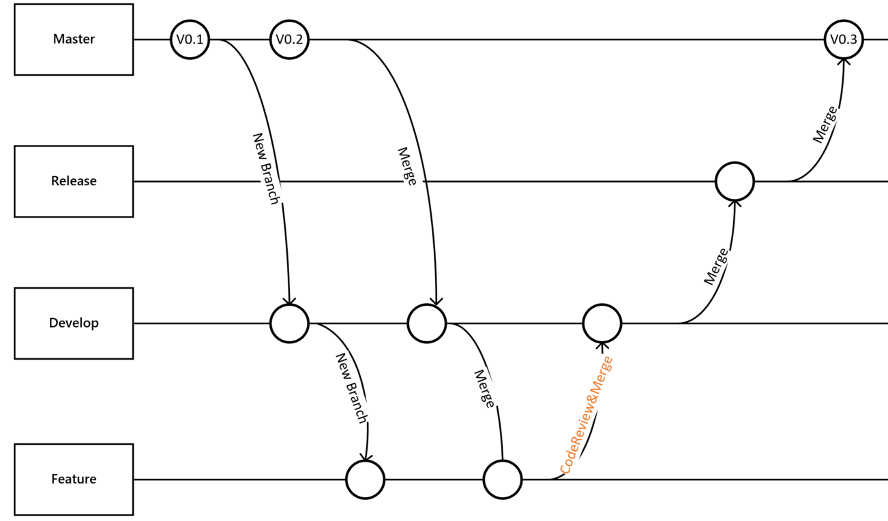

# ITD_HMI小组工程

本工程用于智能HMI部的全部工程，库，所支持项目，工作进度的归档和查看。

# 文件结构说明

* doc
	> 用于存放各种文档

* projects
	> 用于存放各个项目

* others
	> 用于存放其他文件

* share
	> 用于存放已经打包成库的模块，以方便源码的保护， 代码的复用和跨平台的编译。

# 使用规范

* 上传规则
	> 1. 代码提交与管理 [示例](http://10.10.51.40:3000/feng.ding/itd_hmi_group/blob/master/doc/code_management.png)
  >> 1.1. 需求确认后，从master创建develop分支

  >> 1.2. 开发人员从develop分支创建自己的feature分支进行开发

  >> 1.3. master分支发生变更，需要从master分支合并到develop分支、可以考虑定期合并一次

  >> 1.4. feature分支合并到对应的develop分支之前，需要从develop分支合并到feature分支

  >> 1.5. feature分支合并到对应的develop分支之后，发布到测试环境进行测试

  >> 1.6. develop分支在测试环境测试通过之后，合并到release分支并发布到预发布环境进行测试

  >> 1.7. release分支在预发布环境验证通过后，合并到master分支并发布到生产环境进行验证

  >> 1.8. 分支名称约定：

  | 分支类型 | 名称格式             | 说明  |
  | ------- | ------------------- | :----: |
  | Master  | master              | 有且只有一个 |
  | Release | release-*           | *可以是班车发布日期也可以是需求名称缩写，也可以根据需要只用一个release分支 |
  | Develop | develop-*           | *通常是班车发布日期或者需求名称缩写 |
  | Feature | feature-{username}-*|                               |

  >>  
	> 2. 每个工程都应有 `README.md` 和 `CHANGE.md` 。分别用于提供必要的工程说明和大版本更迭的必要说明。
	> 3. 本地端编译的文件应写在 `.gitignore` 文件中，禁止上传。
	> 4. `不符合规定的代码会要求重写！ `

* HTML/JS/CSS的代码规范

* C/C++代码规范
	> 严格按照谷歌的编程规范
	>> * [谷歌的编程规范图](http://10.10.51.40:3000/feng.ding/itd_hmi_group/blob/master/doc/google_coding_standard.jpg)
	>>  
	>> * [谷歌的编程规文档](http://10.10.51.40:3000/feng.ding/itd_hmi_group/blob/master/doc/google_coding_standard.pdf)
	
* C/C++其他规范 
	> 1. ROS
	>> * service/msg: 按照类名写
	>> * topic：驼峰，首字母小写
	>> * package：名字首字母小写 
	> 2. 文件夹名字：小写单词下划线分割
	> 3. 所以文件都应有namespace，一律为`itd_hmi`
	> 4. 文件头的copyright等信息注意填写，有修改的注意在author中添加自己的名字
	> 5. 项目中的可执行文件均使用`yaml`文件传递参数, S32V版本的和ROS版本的区分

ps: [工作计划](http://10.10.51.40:3000/feng.ding/itd_hmi_group/blob/master/doc/work_list.ods)可查看小组各人员的工作安排和优先级。
