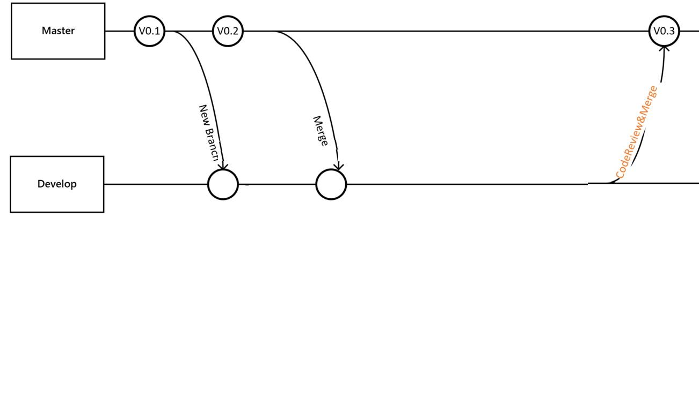
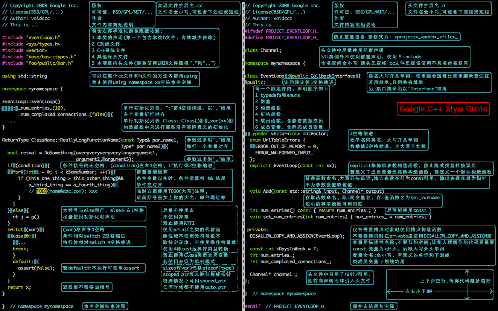

# ITD_HMI小组工程

本工程用于智能HMI部的全部工程，库，所支持项目，工作进度的归档和查看。

# 文件结构说明

* doc
	> 用于存放各种文档

* projects
	> 用于存放各个项目

* others
	> 用于存放其他文件

* share
	> 用于存放已经打包成库的模块，以方便源码的保护， 代码的复用和跨平台的编译。

# 使用规范

* 上传规则
	> 1. 代码提交与管理 [示例](http://10.10.51.40:3000/feng.ding/itd_hmi_group/blob/master/doc/code_management.jpg)
http://10.10.51.40:3000/feng.ding/itd_hmi_group/blob/master/doc/code_management.jpg
  >> 1.1. 需求确认后，从master创建develop分支
  >> 1.2. develop分支在预发布环境验证通过后，合并到master分支并发布到生产环境进行验证
  >> 1.3. 分支名称约定：

  | 分支类型 | 名称格式             | 说明  |
  | ------- | ------------------- | :----: |
  | Master  | master              | 有且只有一个 |
  | Develop | develop-*           | *通常是班车发布日期或者需求名称缩写 |
  >> </br>
	> 2. 每个工程都应有 `README.md` 和 `CHANGE.md` 。分别用于提供必要的工程说明和大版本更迭的必要说明。
	> 3. 本地端编译的文件应写在 `.gitignore` 文件中，禁止上传。
	> 4. `不符合规定的代码会要求重写！ `

* commit 书写规则

``` HTML
<type>(<scope>): <subject>
<BLANK LINE>
<body>
<BLANK LINE>
<footer>
```

> **`type`** 
>> * type为`必填项`，用于指定commit的类型，约定了feat、fix两个主要type，以及docs、style、build、refactor、revert五个特殊type，其余type暂不使用。
>> * 当一次改动包括主要type与特殊type时，统一采用主要type
>> 
``` shell
# 主要type
feat: 增加新功能
fix: 修复bug

# 特殊type
docs: 只改动了文档相关的内容
style: 不影响代码含义的改动，例如去掉空格、改变缩进、增删分号
build: 构造工具的或者外部依赖的改动，例如webpack，npm
refactor: 代码重构时使用
revert: 执行git revert打印的message

# 暂不使用type
test: 添加测试或者修改现有测试
perf: 提高性能的改动
ci: 与CI（持续集成服务）有关的改动
chore: 不修改src或者test的其余修改，例如构建过程或辅助工具的变动
```

> **`scope`** 
>> scope也为必填项，用于描述改动的范围，格式为项目名/模块名

> **`body`** 
>> body填写详细描述，主要描述改动之前的情况及修改动机，对于小的修改不作要求，但是重大需求、更新等必须添加body来作说明。

> **`break changes`** 
>> break changes指明是否产生了破坏性修改，涉及break changes的改动必须指明该项，类似版本升级、接口参数减少、接口删除、迁移等。

> **`affect issues`** 
>> affect issues指明是否影响了某个问题。例如我们使用jira时，我们在commit message中可以填写其影响的JIRA_ID，若要开启该功能需要先打通jira与gitlab。

* HTML/JS/CSS的代码规范

* C/C++代码规范
	> 严格按照谷歌的编程规范
	>> * [谷歌的编程规范图](http://10.10.51.40:3000/feng.ding/itd_hmi_group/blob/master/doc/google_coding_standard.jpg)
	>> </br>
	>> * [谷歌的编程规文档](http://10.10.51.40:3000/feng.ding/itd_hmi_group/blob/master/doc/google_coding_standard.pdf)
	
* C/C++其他规范 
	> 1. ROS
	>> * service/msg: 按照类名写
	>> * topic：驼峰，首字母小写
	>> * package：名字首字母小写 
	> 2. 文件夹名字：小写单词下划线分割
	> 3. 所以文件都应有namespace，一律为`itd_hmi`
	> 4. 文件头的copyright等信息注意填写，有修改的注意在author中添加自己的名字
	> 5. 项目中的可执行文件均使用`yaml`文件传递参数, S32V版本的和ROS版本的区分

ps: [工作计划](http://10.10.51.40:3000/feng.ding/itd_hmi_group/blob/master/doc/work_list.ods)可查看小组各人员的工作安排和优先级。
