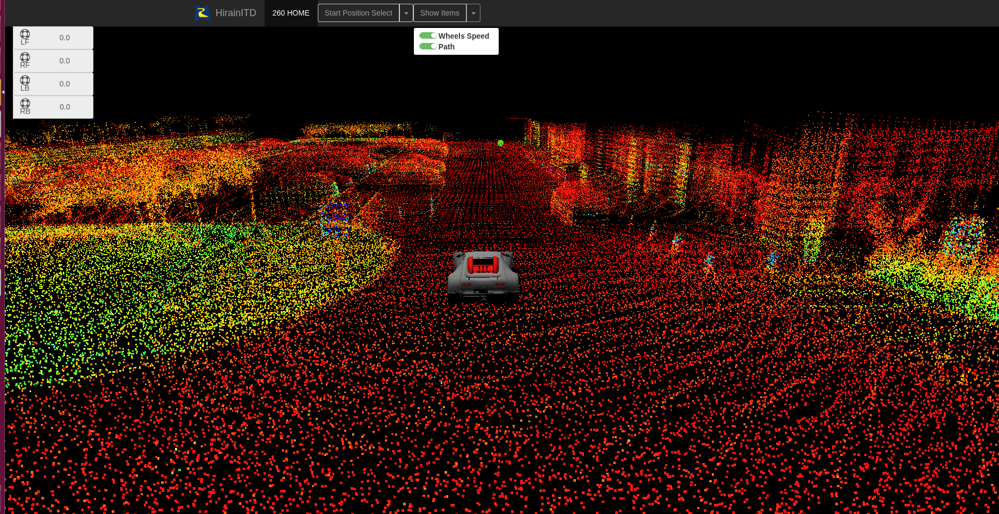

## UI WEB FOR 260 LIDAR Localization

* Use roslib to publish and subscribe rostopic by web socket.

* Use threejs to create a 3D enviroment.

### The main view
 

### Select the display items
 

### Select the start position
 
